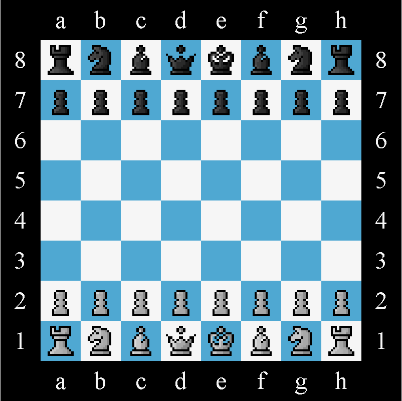

# ChessObjects.Chess Projekt
This is a little chess projekt I work on myself. In the future it should include everything a needed to play a game of ches local against your firends. In the future i may add a chessbot to play aganist, or even an online mode.

## How to play it?
To play it just execute te following java file:
[mainClient.java](src/main/java/Main/MainClient.java)

## Overview
This is how the game looks like:

