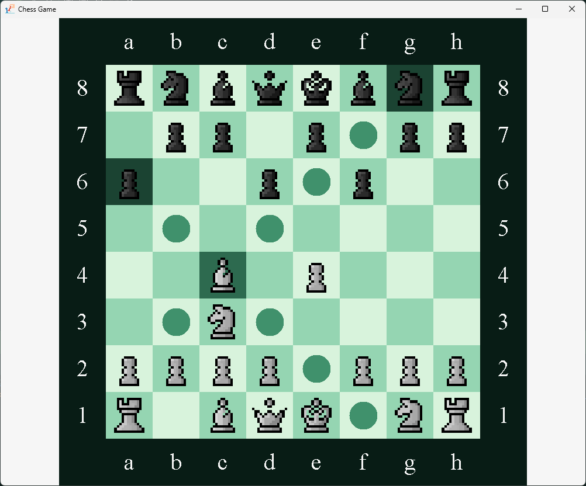

# ChessObjects.Chess Projekt &nbsp; 

This is a little chess projekt I work on myself. 
In the future it should include everything needed to play a game of chess local against your friends. 
In the future I may add a chess-bot to play against, or even an online mode.

## How to play it?
- To play  players need to execute the main client:
  [mainClient.java](src/main/java/Main/MainClient.java)
- Starting this class opens the menu window, where you can select between the different game modes and settings:
  

### playing a game by yourself
- under the point "play local - bot, select if you want the board to turn after each move (with the slider)"
- click on "play local" to start the game

### playing a game against the bot

### playing together

- Player 1:  
  - under the point "play with friends" click on "start"
  
- Player 2:
   - under the point "play with friends" click on the text-field stating "Enter Ip here"
   - Enter the Ip of your friend who has started the server (if you are in the same network write: "localhost")
   - click on "join"
  
## Overview
This is how the game looks like: \

